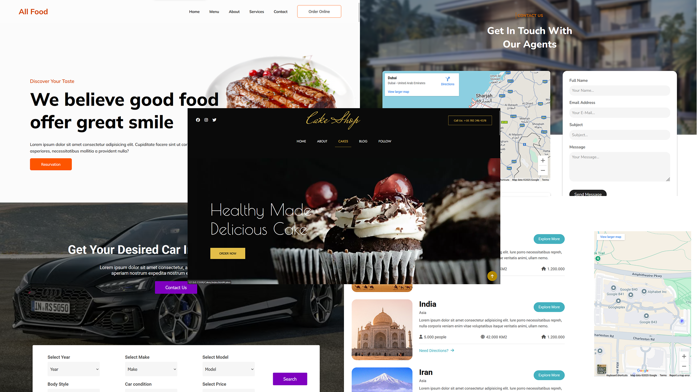

# Vanilla Web Designs 🎨

Welcome to **Vanilla Web Designs**! This repository showcases **5 web designs** implemented using pure **HTML**, **CSS**, and **JavaScript**. Each design is a demonstration of modern, responsive, and visually appealing web layouts built without any frameworks or libraries.

Here’s a collage of the designs included in this repository:

  
_Collage of the 5 web designs implemented in this repository._

---

## 🚀 Features

- **Pure HTML, CSS, and JavaScript**: All designs are implemeted in pure _HTML, CSS and JS_.
- **Modern UI**: Clean and visually appealing user interfaces.
- **Interactive Elements**: Some designs include interactive components like hover effects, animations, and dynamic content.

---

## Gotchas

- All those desings were inspired by templates across the internet, and implemented in Code.
- Designs are not resposnive! They look nice only in desktop devices.

---

## 📂 Designs Included

1. **Design 1**: All Food Restaurant Landing Page

2. **Design 2**: Cakes Shop Landing Page

3. **Design 3**: Carvilla Landing Page: Shop for selling Cars

4. **Design 4**: Cyborg Gaming Website

5. **Design 5**: Video Graph: Photographers Portfolio Website

6. **Design 6**: Villa Agency Landing Page

7. **Design 7**: Woox: Travel Service Simple Landing Page

---

## 🛠️ How to Use

1. **Clone the Repository**:

   ```bash
   git clone https://github.com/MaverickPoly/vanilla_web_designs.git
   ```

2. **Navigate to a Design**:
   Each design is located in its own folder. For example:

   ```bash
   cd AllFood
   ```

3. **Open in Browser**:
   Open the `index.html` file in your preferred browser to view the design.

---

## 🎨 Design Philosophy

This project emphasizes the power of **vanilla web technologies** (HTML, CSS, and JavaScript) to create beautiful and functional designs. The goal is to understand and master the core concepts of web development. Most of the projects contain links of **Font Awesome** for links and **Google Fonts** for attractive fonts.

---

## 💡 Contributing

Contributions are welcome! If you have ideas for new designs or improvements to existing ones, feel free to open an issue or submit a pull request.

1. Fork the repository.
2. Create a new branch for your feature or improvement.
3. Commit your changes.
4. Submit a pull request.

---

## 🙏 Acknowledgments

- Design Inspired by [ColorLib](https://colorlib.com/). and [TemplateMo](https://templatemo.com/)

---

Enjoy exploring the designs! If you find this project helpful, don’t forget to ⭐️ star the repository and share it with others. In the future, this repository will grow with further design Projects.
